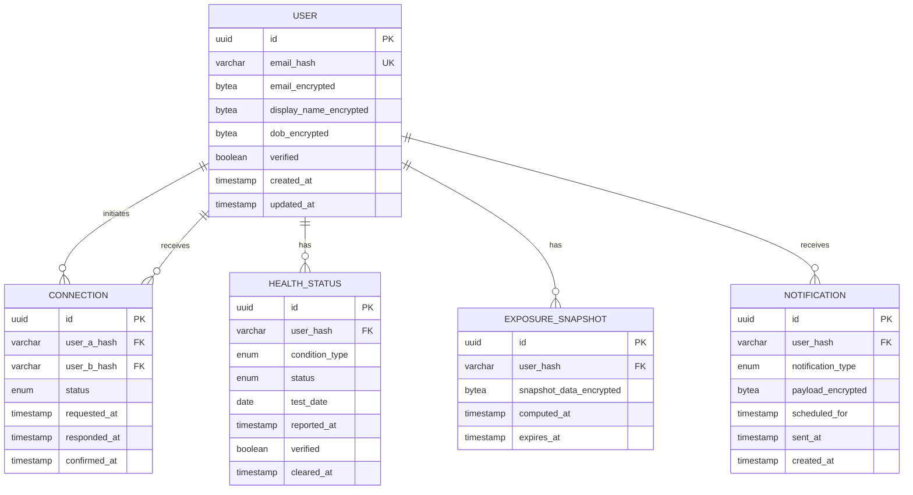

# Data Model

Database schema design for Navilla.

## Entity Relationship Diagram



## Tables

### users

Primary user table with encrypted PII.

```sql
CREATE TABLE users (
    id UUID PRIMARY KEY DEFAULT gen_random_uuid(),
    email_hash VARCHAR(64) UNIQUE NOT NULL,
    email_encrypted BYTEA NOT NULL,
    display_name_encrypted BYTEA,
    dob_encrypted BYTEA,
    verified BOOLEAN DEFAULT FALSE,
    created_at TIMESTAMPTZ DEFAULT NOW(),
    updated_at TIMESTAMPTZ DEFAULT NOW()
);

CREATE INDEX idx_users_email_hash ON users(email_hash);
```

### connections

Bidirectional connections between users.

```sql
CREATE TYPE connection_status AS ENUM (
    'pending',
    'confirmed',
    'denied',
    'expired'
);

CREATE TABLE connections (
    id UUID PRIMARY KEY DEFAULT gen_random_uuid(),
    user_a_hash VARCHAR(64) NOT NULL,
    user_b_hash VARCHAR(64) NOT NULL,
    status connection_status DEFAULT 'pending',
    requested_at TIMESTAMPTZ DEFAULT NOW(),
    responded_at TIMESTAMPTZ,
    confirmed_at TIMESTAMPTZ,

    CONSTRAINT unique_connection UNIQUE (user_a_hash, user_b_hash),
    CONSTRAINT no_self_connection CHECK (user_a_hash != user_b_hash)
);

CREATE INDEX idx_connections_user_a ON connections(user_a_hash);
CREATE INDEX idx_connections_user_b ON connections(user_b_hash);
CREATE INDEX idx_connections_status ON connections(status);
```

### health_status

User health records (encrypted).

```sql
CREATE TYPE condition_type AS ENUM (
    'chlamydia',
    'gonorrhea',
    'syphilis',
    'hiv',
    'hsv1',
    'hsv2',
    'hpv',
    'hepatitis_b',
    'hepatitis_c',
    'trichomoniasis'
);

CREATE TYPE health_status_value AS ENUM (
    'positive',
    'negative',
    'unknown'
);

CREATE TABLE health_status (
    id UUID PRIMARY KEY DEFAULT gen_random_uuid(),
    user_hash VARCHAR(64) NOT NULL,
    condition_type condition_type NOT NULL,
    status health_status_value NOT NULL,
    test_date DATE,
    reported_at TIMESTAMPTZ DEFAULT NOW(),
    verified BOOLEAN DEFAULT FALSE,
    cleared_at TIMESTAMPTZ,

    CONSTRAINT unique_condition_per_user UNIQUE (user_hash, condition_type)
);

CREATE INDEX idx_health_status_user ON health_status(user_hash);
CREATE INDEX idx_health_status_condition ON health_status(condition_type);
```

### exposure_snapshots

Cached exposure calculations.

```sql
CREATE TABLE exposure_snapshots (
    id UUID PRIMARY KEY DEFAULT gen_random_uuid(),
    user_hash VARCHAR(64) NOT NULL,
    snapshot_data_encrypted BYTEA NOT NULL,
    computed_at TIMESTAMPTZ DEFAULT NOW(),
    expires_at TIMESTAMPTZ NOT NULL,

    CONSTRAINT unique_snapshot_per_user UNIQUE (user_hash)
);

CREATE INDEX idx_snapshots_user ON exposure_snapshots(user_hash);
CREATE INDEX idx_snapshots_expires ON exposure_snapshots(expires_at);
```

### notifications

Notification queue for batched delivery.

```sql
CREATE TYPE notification_type AS ENUM (
    'connection_request',
    'connection_confirmed',
    'exposure_alert',
    'exposure_cleared',
    'account_security'
);

CREATE TABLE notifications (
    id UUID PRIMARY KEY DEFAULT gen_random_uuid(),
    user_hash VARCHAR(64) NOT NULL,
    notification_type notification_type NOT NULL,
    payload_encrypted BYTEA NOT NULL,
    scheduled_for TIMESTAMPTZ NOT NULL,
    sent_at TIMESTAMPTZ,
    created_at TIMESTAMPTZ DEFAULT NOW()
);

CREATE INDEX idx_notifications_user ON notifications(user_hash);
CREATE INDEX idx_notifications_scheduled ON notifications(scheduled_for)
    WHERE sent_at IS NULL;
```

## Row Level Security

```sql
-- Enable RLS on all tables
ALTER TABLE users ENABLE ROW LEVEL SECURITY;
ALTER TABLE connections ENABLE ROW LEVEL SECURITY;
ALTER TABLE health_status ENABLE ROW LEVEL SECURITY;
ALTER TABLE exposure_snapshots ENABLE ROW LEVEL SECURITY;
ALTER TABLE notifications ENABLE ROW LEVEL SECURITY;

-- Users can only see their own data
CREATE POLICY users_own_data ON users
    FOR ALL USING (email_hash = current_user_hash());

-- Users can see connections they're part of
CREATE POLICY connections_own_data ON connections
    FOR ALL USING (
        user_a_hash = current_user_hash() OR
        user_b_hash = current_user_hash()
    );

-- Users can only see their own health status
CREATE POLICY health_own_data ON health_status
    FOR ALL USING (user_hash = current_user_hash());

-- Users can only see their own snapshots
CREATE POLICY snapshots_own_data ON exposure_snapshots
    FOR ALL USING (user_hash = current_user_hash());

-- Users can only see their own notifications
CREATE POLICY notifications_own_data ON notifications
    FOR ALL USING (user_hash = current_user_hash());
```

## Supported STIs Reference

| STI | Clearable | Notes |
|-----|-----------|-------|
| Chlamydia | Yes | Curable with antibiotics |
| Gonorrhea | Yes | Curable with antibiotics |
| Syphilis | Yes | Curable with antibiotics |
| HIV | No | Manageable, not curable |
| HSV-1 | No | Herpes simplex virus 1 |
| HSV-2 | No | Herpes simplex virus 2 |
| HPV | Partial | Can clear naturally |
| Hepatitis B | Partial | Can become chronic |
| Hepatitis C | Yes | Curable with antivirals |
| Trichomoniasis | Yes | Curable with antibiotics |
