# Data Model

Database schema design for Navilla. Migrations are numbered SQL files in `database/migrations/`. Current schema spans migrations 001 through 015.

## Entity Relationship Diagram

```mermaid
erDiagram
    USER ||--o{ CONNECTION : "initiates"
    USER ||--o{ CONNECTION : "receives"
    USER ||--o{ HEALTH_STATUS : "has"
    USER ||--o{ EXPOSURE_SNAPSHOT : "has"
    USER ||--o{ NOTIFICATION : "receives"
    USER ||--o{ ENCOUNTER_JOURNAL : "writes"
    USER ||--o{ JOURNAL_PARTNER : "tracks"
    USER ||--o{ TEST_VISIT : "records"
    USER ||--o{ LAB : "saves"
    USER ||--o{ MEDICATION : "tracks"
    USER ||--o{ VACCINATION : "records"
    USER ||--o{ REMINDER : "has"
    USER ||--o| REMINDER_SETTINGS : "configures"
    USER ||--o{ PUSH_SUBSCRIPTION : "registers"
    USER ||--o{ CONNECTION_PHONE_ENTRY : "logs"
    USER ||--o{ PHONE_BLOCK : "blocks"
    USER ||--o{ JOURNAL_FIELD_TEMPLATE : "customizes"

    ENCOUNTER_JOURNAL }o--o| JOURNAL_PARTNER : "references"
    ENCOUNTER_JOURNAL }o--o| CONNECTION : "linked to"
    ENCOUNTER_JOURNAL }o--o| CONNECTION_PHONE_ENTRY : "produces"

    TEST_VISIT ||--o{ TEST_RESULT : "contains"
    TEST_VISIT }o--o| LAB : "at"
    LAB ||--o{ LAB_CREDENTIAL : "has"

    MEDICATION ||--o{ MEDICATION_LOG : "tracked by"
    REMINDER }o--o| MEDICATION : "references"
    REMINDER }o--o| VACCINATION : "references"

    USER {
        uuid id PK
        varchar email_hash UK
        bytea email_encrypted
        bytea display_name_encrypted
        bytea dob_encrypted
        boolean verified
        boolean receive_match_notifications
        boolean exposure_opted_in
        timestamptz exposure_opted_in_at
        timestamptz exposure_opted_out_at
        timestamptz created_at
        timestamptz updated_at
    }

    CONNECTION {
        uuid id PK
        varchar user_a_hash FK
        varchar user_b_hash FK
        varchar connection_type
        enum status
        timestamptz requested_at
        timestamptz responded_at
        timestamptz confirmed_at
    }

    HEALTH_STATUS {
        uuid id PK
        varchar user_hash FK
        enum condition_type
        enum status
        date test_date
        timestamptz reported_at
        boolean verified
        timestamptz cleared_at
    }

    EXPOSURE_SNAPSHOT {
        uuid id PK
        varchar user_hash FK
        bytea snapshot_data_encrypted
        timestamptz computed_at
        timestamptz expires_at
    }

    NOTIFICATION {
        uuid id PK
        varchar user_hash FK
        enum notification_type
        bytea payload_encrypted
        timestamptz scheduled_for
        timestamptz sent_at
        timestamptz read_at
        timestamptz created_at
    }

    ENCOUNTER_JOURNAL {
        uuid id PK
        varchar user_hash FK
        date encounter_date
        bytea partner_alias_encrypted
        uuid connection_id FK
        uuid partner_id FK
        bytea notes_encrypted
        bytea custom_fields_encrypted
        bytea encounter_types_encrypted
        bytea protection_methods_encrypted
        varchar phone_hash
        timestamptz created_at
        timestamptz updated_at
    }

    JOURNAL_FIELD_TEMPLATE {
        uuid id PK
        varchar user_hash FK
        bytea label_encrypted
        integer display_order
        timestamptz created_at
    }

    JOURNAL_PARTNER {
        uuid id PK
        varchar user_hash FK
        bytea alias_encrypted
        uuid connection_id FK
        bytea notes_encrypted
        timestamptz created_at
        timestamptz updated_at
    }

    TEST_VISIT {
        uuid id PK
        varchar user_hash FK
        date test_date
        uuid lab_id FK
        bytea lab_reference_encrypted
        bytea notes_encrypted
        boolean verified
        timestamptz verified_at
        bytea raw_lab_response_encrypted
        timestamptz created_at
        timestamptz updated_at
    }

    TEST_RESULT {
        uuid id PK
        uuid visit_id FK
        varchar condition_type
        bytea custom_condition_encrypted
        varchar status
        bytea result_value_encrypted
        varchar reference_range
        timestamptz cleared_at
        bytea document_ref_encrypted
        timestamptz created_at
        timestamptz updated_at
    }

    LAB {
        uuid id PK
        varchar user_hash FK
        varchar provider
        bytea name_encrypted
        timestamptz created_at
    }

    LAB_CREDENTIAL {
        uuid id PK
        uuid lab_id FK
        varchar credential_key
        bytea value_encrypted
    }

    MEDICATION {
        uuid id PK
        varchar user_hash FK
        varchar medication_type
        bytea name_encrypted
        bytea dosage_encrypted
        date start_date
        date end_date
        varchar frequency
        time reminder_time
        bytea notes_encrypted
        boolean active
        timestamptz created_at
        timestamptz updated_at
    }

    MEDICATION_LOG {
        uuid id PK
        uuid medication_id FK
        varchar user_hash FK
        timestamptz logged_at
        date scheduled_for
        boolean taken
        bytea notes_encrypted
        timestamptz created_at
    }

    VACCINATION {
        uuid id PK
        varchar user_hash FK
        varchar vaccine_type
        integer dose_number
        integer total_doses
        date administered_date
        bytea location_encrypted
        bytea notes_encrypted
        timestamptz created_at
    }

    REMINDER {
        uuid id PK
        varchar user_hash FK
        varchar reminder_type
        uuid reference_id
        bytea title_encrypted
        bytea message_encrypted
        timestamptz scheduled_for
        varchar repeat_rule
        timestamptz snoozed_until
        timestamptz completed_at
        boolean active
        timestamptz created_at
        timestamptz updated_at
    }

    REMINDER_SETTINGS {
        uuid id PK
        varchar user_hash UK
        time quiet_hours_start
        time quiet_hours_end
        boolean email_digest_enabled
        varchar email_digest_day
        boolean testing_reminders_enabled
        boolean medication_reminders_enabled
        boolean vaccination_reminders_enabled
        timestamptz created_at
        timestamptz updated_at
    }

    PUSH_SUBSCRIPTION {
        uuid id PK
        varchar user_hash FK
        bytea endpoint_encrypted
        bytea p256dh_encrypted
        bytea auth_encrypted
        timestamptz created_at
        timestamptz updated_at
    }

    CONNECTION_PHONE_ENTRY {
        uuid id PK
        varchar user_hash FK
        varchar phone_hash
        date encounter_date
        uuid journal_entry_id FK
        boolean matched
        timestamptz created_at
    }

    PHONE_BLOCK {
        uuid id PK
        varchar user_hash FK
        varchar blocked_phone_hash
        timestamptz created_at
    }

    PHONE_REPORT {
        uuid id PK
        varchar reporter_hash FK
        varchar reported_phone_hash
        varchar reason
        timestamptz created_at
    }

    CONDITION_CATALOG {
        uuid id PK
        varchar code UK
        varchar display_name
        varchar display_name_es
        text description
        text description_es
        integer display_order
        boolean active
        varchar icon
        timestamptz created_at
        timestamptz updated_at
    }

    NETWORK_STAGE {
        uuid id PK
        varchar code UK
        varchar display_name
        varchar display_name_es
        integer min_nodes
        integer max_nodes
        text description
        text description_es
        integer display_order
        timestamptz created_at
    }

    APP_CONFIG {
        uuid id PK
        varchar config_key UK
        text config_value
        text description
        timestamptz created_at
        timestamptz updated_at
    }
```



## Tables

### users

Primary user table with encrypted PII. Extended in migration 014 with reciprocity and phone-match columns.

```sql
CREATE TABLE users (
    id UUID PRIMARY KEY DEFAULT gen_random_uuid(),
    email_hash VARCHAR(64) UNIQUE NOT NULL,
    email_encrypted BYTEA NOT NULL,
    display_name_encrypted BYTEA,
    dob_encrypted BYTEA,
    verified BOOLEAN DEFAULT FALSE,
    receive_match_notifications BOOLEAN NOT NULL DEFAULT FALSE,
    exposure_opted_in BOOLEAN NOT NULL DEFAULT FALSE,
    exposure_opted_in_at TIMESTAMPTZ,
    exposure_opted_out_at TIMESTAMPTZ,
    created_at TIMESTAMPTZ DEFAULT NOW(),
    updated_at TIMESTAMPTZ DEFAULT NOW()
);

CREATE INDEX idx_users_email_hash ON users(email_hash);
```

### connections

Bidirectional connections between users. Extended in migration 014 with `connection_type`.

```sql
CREATE TYPE connection_status AS ENUM (
    'pending',
    'confirmed',
    'denied',
    'expired'
);

CREATE TABLE connections (
    id UUID PRIMARY KEY DEFAULT gen_random_uuid(),
    user_a_hash VARCHAR(64) NOT NULL,
    user_b_hash VARCHAR(64) NOT NULL,
    status connection_status DEFAULT 'pending',
    connection_type VARCHAR(30) DEFAULT 'EXPLICIT',
    requested_at TIMESTAMPTZ DEFAULT NOW(),
    responded_at TIMESTAMPTZ,
    confirmed_at TIMESTAMPTZ,

    CONSTRAINT unique_connection UNIQUE (user_a_hash, user_b_hash),
    CONSTRAINT no_self_connection CHECK (user_a_hash != user_b_hash)
);

-- connection_type values: PHONE_MATCH, NOTIFICATION_MATCH, EXPLICIT, LINK

CREATE INDEX idx_connections_user_a ON connections(user_a_hash);
CREATE INDEX idx_connections_user_b ON connections(user_b_hash);
CREATE INDEX idx_connections_status ON connections(status);
```

### health_status

User health records (encrypted).

```sql
CREATE TYPE condition_type AS ENUM (
    'chlamydia', 'gonorrhea', 'syphilis', 'hiv',
    'hsv1', 'hsv2', 'hpv',
    'hepatitis_b', 'hepatitis_c', 'trichomoniasis'
);

CREATE TYPE health_status_value AS ENUM (
    'positive', 'negative', 'unknown'
);

CREATE TABLE health_status (
    id UUID PRIMARY KEY DEFAULT gen_random_uuid(),
    user_hash VARCHAR(64) NOT NULL,
    condition_type condition_type NOT NULL,
    status health_status_value NOT NULL,
    test_date DATE,
    reported_at TIMESTAMPTZ DEFAULT NOW(),
    verified BOOLEAN DEFAULT FALSE,
    cleared_at TIMESTAMPTZ,

    CONSTRAINT unique_condition_per_user UNIQUE (user_hash, condition_type)
);

CREATE INDEX idx_health_status_user ON health_status(user_hash);
CREATE INDEX idx_health_status_condition ON health_status(condition_type);
```

### exposure_snapshots

Cached exposure calculations.

```sql
CREATE TABLE exposure_snapshots (
    id UUID PRIMARY KEY DEFAULT gen_random_uuid(),
    user_hash VARCHAR(64) NOT NULL,
    snapshot_data_encrypted BYTEA NOT NULL,
    computed_at TIMESTAMPTZ DEFAULT NOW(),
    expires_at TIMESTAMPTZ NOT NULL,

    CONSTRAINT unique_snapshot_per_user UNIQUE (user_hash)
);

CREATE INDEX idx_snapshots_user ON exposure_snapshots(user_hash);
CREATE INDEX idx_snapshots_expires ON exposure_snapshots(expires_at);
```

### notifications

Notification queue with support for batched and immediate delivery.

```sql
-- NotificationType enum (Java-side, stored as VARCHAR in practice):
-- CONNECTION_REQUEST, CONNECTION_CONFIRMED, CONNECTION_DENIED,
-- EXPOSURE_ALERT, EXPOSURE_CLEARED, ACCOUNT_SECURITY,
-- MEDICATION_REMINDER, VACCINATION_REMINDER, TESTING_REMINDER, FOLLOW_UP_REMINDER

CREATE TABLE notifications (
    id UUID PRIMARY KEY DEFAULT gen_random_uuid(),
    user_hash VARCHAR(64) NOT NULL,
    notification_type notification_type NOT NULL,
    payload_encrypted BYTEA NOT NULL,
    scheduled_for TIMESTAMPTZ NOT NULL,
    sent_at TIMESTAMPTZ,
    read_at TIMESTAMPTZ,
    created_at TIMESTAMPTZ DEFAULT NOW()
);

CREATE INDEX idx_notifications_user ON notifications(user_hash);
CREATE INDEX idx_notifications_scheduled ON notifications(scheduled_for)
    WHERE sent_at IS NULL;
```

### encounter_journal (Migration 008, 012, 014)

Encrypted encounter journal entries. Extended with encounter types and protection methods (012) and phone hash for matching (014).

```sql
CREATE TABLE encounter_journal (
    id UUID PRIMARY KEY DEFAULT uuid_generate_v4(),
    user_hash VARCHAR(64) NOT NULL,
    encounter_date DATE NOT NULL,
    partner_alias_encrypted BYTEA,
    connection_id UUID REFERENCES connections(id) ON DELETE SET NULL,
    partner_id UUID REFERENCES journal_partners(id) ON DELETE SET NULL,
    notes_encrypted BYTEA,
    custom_fields_encrypted BYTEA,
    encounter_types_encrypted BYTEA,
    protection_methods_encrypted BYTEA,
    phone_hash VARCHAR(64),
    created_at TIMESTAMPTZ NOT NULL DEFAULT NOW(),
    updated_at TIMESTAMPTZ NOT NULL DEFAULT NOW()
);

CREATE INDEX idx_encounter_journal_user ON encounter_journal(user_hash);
CREATE INDEX idx_encounter_journal_date ON encounter_journal(user_hash, encounter_date DESC);
CREATE INDEX idx_encounter_journal_partner ON encounter_journal(partner_id);
CREATE INDEX idx_journal_phone_hash ON encounter_journal(phone_hash) WHERE phone_hash IS NOT NULL;
```

Encrypted fields:
- `partner_alias_encrypted` — AES-256-GCM encrypted freeform partner alias
- `notes_encrypted` — AES-256-GCM encrypted freeform notes
- `custom_fields_encrypted` — AES-256-GCM encrypted JSON array `[{label, value}]`, max 3
- `encounter_types_encrypted` — AES-256-GCM encrypted JSON array of encounter type strings
- `protection_methods_encrypted` — AES-256-GCM encrypted JSON array of protection method strings

### journal_field_templates (Migration 008)

User-saved custom field labels for encounter journal. Max 3 per user.

```sql
CREATE TABLE journal_field_templates (
    id UUID PRIMARY KEY DEFAULT uuid_generate_v4(),
    user_hash VARCHAR(64) NOT NULL,
    label_encrypted BYTEA NOT NULL,
    display_order INTEGER NOT NULL,
    created_at TIMESTAMPTZ NOT NULL DEFAULT NOW(),
    CONSTRAINT uq_template_per_user_order UNIQUE (user_hash, display_order),
    CONSTRAINT chk_display_order CHECK (display_order BETWEEN 1 AND 3)
);

CREATE INDEX idx_journal_templates_user ON journal_field_templates(user_hash);
```

### journal_partners (Migration 009)

Encrypted recurring partner entries.

```sql
CREATE TABLE journal_partners (
    id UUID PRIMARY KEY DEFAULT uuid_generate_v4(),
    user_hash VARCHAR(64) NOT NULL,
    alias_encrypted BYTEA NOT NULL,
    connection_id UUID REFERENCES connections(id) ON DELETE SET NULL,
    notes_encrypted BYTEA,
    created_at TIMESTAMPTZ NOT NULL DEFAULT NOW(),
    updated_at TIMESTAMPTZ NOT NULL DEFAULT NOW()
);

CREATE INDEX idx_journal_partners_user ON journal_partners(user_hash);
```

### labs (Migration 010)

User-saved lab profiles (Chopo, Salud Digna, etc.). Provider column widened to VARCHAR(50) in migration 015.

```sql
CREATE TABLE labs (
    id UUID PRIMARY KEY DEFAULT uuid_generate_v4(),
    user_hash VARCHAR(64) NOT NULL,
    provider VARCHAR(50) NOT NULL,
    name_encrypted BYTEA NOT NULL,
    created_at TIMESTAMPTZ NOT NULL DEFAULT NOW()
);

CREATE INDEX idx_labs_user ON labs(user_hash);
```

### lab_credentials (Migration 010)

EAV key-value credentials per lab (patient_id, account_number, etc.). Values are AES-256-GCM encrypted.

```sql
CREATE TABLE lab_credentials (
    id UUID PRIMARY KEY DEFAULT uuid_generate_v4(),
    lab_id UUID NOT NULL REFERENCES labs(id) ON DELETE CASCADE,
    credential_key VARCHAR(64) NOT NULL,
    value_encrypted BYTEA NOT NULL,
    UNIQUE (lab_id, credential_key)
);
```

### test_visits (Migration 010, 015)

Test visit log. One row per lab visit. Extended in migration 015 with `raw_lab_response_encrypted`.

```sql
CREATE TABLE test_visits (
    id UUID PRIMARY KEY DEFAULT uuid_generate_v4(),
    user_hash VARCHAR(64) NOT NULL,
    test_date DATE NOT NULL,
    lab_id UUID REFERENCES labs(id) ON DELETE SET NULL,
    lab_reference_encrypted BYTEA,
    notes_encrypted BYTEA,
    verified BOOLEAN NOT NULL DEFAULT FALSE,
    verified_at TIMESTAMPTZ,
    raw_lab_response_encrypted BYTEA,
    created_at TIMESTAMPTZ NOT NULL DEFAULT NOW(),
    updated_at TIMESTAMPTZ NOT NULL DEFAULT NOW()
);

CREATE INDEX idx_test_visits_user ON test_visits(user_hash);
CREATE INDEX idx_test_visits_date ON test_visits(user_hash, test_date DESC);
```

### test_results (Migration 010)

Per-condition results within a test visit. `custom_condition` and `result_value` are AES-256-GCM encrypted. `reference_range` is plaintext (public medical knowledge).

```sql
CREATE TABLE test_results (
    id UUID PRIMARY KEY DEFAULT uuid_generate_v4(),
    visit_id UUID NOT NULL REFERENCES test_visits(id) ON DELETE CASCADE,
    condition_type VARCHAR(32),
    custom_condition_encrypted BYTEA,
    status VARCHAR(16) NOT NULL,
    result_value_encrypted BYTEA,
    reference_range VARCHAR(200),
    cleared_at TIMESTAMPTZ,
    document_ref_encrypted BYTEA,
    created_at TIMESTAMPTZ NOT NULL DEFAULT NOW(),
    updated_at TIMESTAMPTZ NOT NULL DEFAULT NOW()
);

CREATE INDEX idx_test_results_visit ON test_results(visit_id);
CREATE INDEX idx_test_results_condition ON test_results(condition_type);
```

### medications (Migration 011)

Active medications a user is tracking (PrEP, antibiotics, antivirals, etc.).

```sql
CREATE TABLE medications (
    id UUID PRIMARY KEY DEFAULT uuid_generate_v4(),
    user_hash VARCHAR(64) NOT NULL,
    medication_type VARCHAR(32) NOT NULL,
    name_encrypted BYTEA NOT NULL,
    dosage_encrypted BYTEA,
    start_date DATE NOT NULL,
    end_date DATE,
    frequency VARCHAR(32) NOT NULL,
    reminder_time TIME,
    notes_encrypted BYTEA,
    active BOOLEAN NOT NULL DEFAULT TRUE,
    created_at TIMESTAMPTZ NOT NULL DEFAULT NOW(),
    updated_at TIMESTAMPTZ NOT NULL DEFAULT NOW()
);

CREATE INDEX idx_medications_user ON medications(user_hash);
```

### medication_logs (Migration 011)

Per-day medication adherence log.

```sql
CREATE TABLE medication_logs (
    id UUID PRIMARY KEY DEFAULT uuid_generate_v4(),
    medication_id UUID NOT NULL REFERENCES medications(id) ON DELETE CASCADE,
    user_hash VARCHAR(64) NOT NULL,
    logged_at TIMESTAMPTZ NOT NULL DEFAULT NOW(),
    scheduled_for DATE NOT NULL,
    taken BOOLEAN NOT NULL,
    notes_encrypted BYTEA,
    created_at TIMESTAMPTZ NOT NULL DEFAULT NOW()
);

CREATE INDEX idx_medication_logs_medication ON medication_logs(medication_id);
CREATE INDEX idx_medication_logs_user_date ON medication_logs(user_hash, scheduled_for);
```

### vaccinations (Migration 011)

Vaccination records (HPV, Hepatitis A/B, Mpox, etc.).

```sql
CREATE TABLE vaccinations (
    id UUID PRIMARY KEY DEFAULT uuid_generate_v4(),
    user_hash VARCHAR(64) NOT NULL,
    vaccine_type VARCHAR(32) NOT NULL,
    dose_number INTEGER NOT NULL,
    total_doses INTEGER NOT NULL,
    administered_date DATE NOT NULL,
    location_encrypted BYTEA,
    notes_encrypted BYTEA,
    created_at TIMESTAMPTZ NOT NULL DEFAULT NOW()
);

CREATE INDEX idx_vaccinations_user ON vaccinations(user_hash);
CREATE INDEX idx_vaccinations_user_type ON vaccinations(user_hash, vaccine_type);
```

### reminders (Migration 011)

Unified reminder system for testing, medication, vaccination, and custom reminders.

```sql
CREATE TABLE reminders (
    id UUID PRIMARY KEY DEFAULT uuid_generate_v4(),
    user_hash VARCHAR(64) NOT NULL,
    reminder_type VARCHAR(32) NOT NULL,
    reference_id UUID,
    title_encrypted BYTEA NOT NULL,
    message_encrypted BYTEA,
    scheduled_for TIMESTAMPTZ NOT NULL,
    repeat_rule VARCHAR(64),
    snoozed_until TIMESTAMPTZ,
    completed_at TIMESTAMPTZ,
    active BOOLEAN NOT NULL DEFAULT TRUE,
    created_at TIMESTAMPTZ NOT NULL DEFAULT NOW(),
    updated_at TIMESTAMPTZ NOT NULL DEFAULT NOW()
);

CREATE INDEX idx_reminders_user ON reminders(user_hash);
CREATE INDEX idx_reminders_pending ON reminders(scheduled_for)
    WHERE completed_at IS NULL AND active = TRUE;
CREATE INDEX idx_reminders_reference ON reminders(reference_id)
    WHERE reference_id IS NOT NULL;
```

### reminder_settings (Migration 011)

Per-user reminder preferences. One row per user (`user_hash` is UNIQUE).

```sql
CREATE TABLE reminder_settings (
    id UUID PRIMARY KEY DEFAULT uuid_generate_v4(),
    user_hash VARCHAR(64) NOT NULL UNIQUE,
    quiet_hours_start TIME,
    quiet_hours_end TIME,
    email_digest_enabled BOOLEAN NOT NULL DEFAULT FALSE,
    email_digest_day VARCHAR(12),
    testing_reminders_enabled BOOLEAN NOT NULL DEFAULT TRUE,
    medication_reminders_enabled BOOLEAN NOT NULL DEFAULT TRUE,
    vaccination_reminders_enabled BOOLEAN NOT NULL DEFAULT TRUE,
    created_at TIMESTAMPTZ NOT NULL DEFAULT NOW(),
    updated_at TIMESTAMPTZ NOT NULL DEFAULT NOW()
);
```

### push_subscriptions (Migration 013)

Web Push subscription data. All sensitive fields (endpoint, p256dh, auth) are AES-256-GCM encrypted.

```sql
CREATE TABLE push_subscriptions (
    id UUID PRIMARY KEY DEFAULT gen_random_uuid(),
    user_hash VARCHAR(64) NOT NULL,
    endpoint_encrypted BYTEA NOT NULL,
    p256dh_encrypted BYTEA NOT NULL,
    auth_encrypted BYTEA NOT NULL,
    created_at TIMESTAMPTZ NOT NULL DEFAULT now(),
    updated_at TIMESTAMPTZ NOT NULL DEFAULT now()
);

CREATE INDEX idx_push_subscriptions_user_hash ON push_subscriptions(user_hash);
```

### condition_catalog (Migration 014)

Database-driven catalog of STI conditions, replacing the hardcoded `ConditionType` enum. Supports bilingual names and descriptions.

```sql
CREATE TABLE condition_catalog (
    id UUID PRIMARY KEY DEFAULT gen_random_uuid(),
    code VARCHAR(50) NOT NULL UNIQUE,
    display_name VARCHAR(100) NOT NULL,
    display_name_es VARCHAR(100),
    description TEXT,
    description_es TEXT,
    display_order INTEGER NOT NULL DEFAULT 0,
    active BOOLEAN NOT NULL DEFAULT TRUE,
    icon VARCHAR(50),
    created_at TIMESTAMPTZ NOT NULL DEFAULT now(),
    updated_at TIMESTAMPTZ NOT NULL DEFAULT now()
);

-- Seeded with: CHLAMYDIA, GONORRHEA, SYPHILIS, HIV, HSV1, HSV2,
-- HPV, HEPATITIS_B, HEPATITIS_C, TRICHOMONIASIS
```

### network_stages (Migration 014)

Configurable constellation stage thresholds for network visualization badges.

```sql
CREATE TABLE network_stages (
    id UUID PRIMARY KEY DEFAULT gen_random_uuid(),
    code VARCHAR(50) NOT NULL UNIQUE,
    display_name VARCHAR(100) NOT NULL,
    display_name_es VARCHAR(100),
    min_nodes INTEGER NOT NULL,
    max_nodes INTEGER,
    description TEXT,
    description_es TEXT,
    display_order INTEGER NOT NULL DEFAULT 0,
    created_at TIMESTAMPTZ NOT NULL DEFAULT now()
);

-- Seeded stages:
-- EMPTY_SKY (0), SPARK (1-50), CLUSTER (51-500),
-- CONSTELLATION (501-2000), GALAXY (2001-10000), SUPERCLUSTER (10001+)
```

### app_config (Migration 014)

Runtime key-value configuration. No redeployment needed to change values.

```sql
CREATE TABLE app_config (
    id UUID PRIMARY KEY DEFAULT gen_random_uuid(),
    config_key VARCHAR(100) NOT NULL UNIQUE,
    config_value TEXT NOT NULL,
    description TEXT,
    created_at TIMESTAMPTZ NOT NULL DEFAULT now(),
    updated_at TIMESTAMPTZ NOT NULL DEFAULT now()
);

-- Seeded keys:
-- phone_match.window_days = 2
-- phone_match.max_attempts_per_week = 5
-- phone_match.denial_cooldown_threshold = 3
-- reciprocity.cooldown_days = 15
-- exposure.min_connections = 3
-- exposure.max_depth = 3
-- exposure.snapshot_ttl_days = 7
-- verification.qr_token_lifetime_minutes = 5
-- verification.default_expiry_days = 30
-- verification.max_view_limit = 5
```

### connection_phone_entries (Migration 014)

Phone hashes from journal entries for auto-matching connections.

```sql
CREATE TABLE connection_phone_entries (
    id UUID PRIMARY KEY DEFAULT gen_random_uuid(),
    user_hash VARCHAR(64) NOT NULL,
    phone_hash VARCHAR(64) NOT NULL,
    encounter_date DATE NOT NULL,
    journal_entry_id UUID REFERENCES encounter_journal(id) ON DELETE CASCADE,
    matched BOOLEAN NOT NULL DEFAULT FALSE,
    created_at TIMESTAMPTZ NOT NULL DEFAULT now()
);

CREATE INDEX idx_phone_entries_phone_hash ON connection_phone_entries(phone_hash);
CREATE INDEX idx_phone_entries_user_hash ON connection_phone_entries(user_hash);
CREATE INDEX idx_phone_entries_unmatched ON connection_phone_entries(phone_hash, matched)
    WHERE matched = FALSE;
```

### phone_blocks (Migration 014)

Blocked phone hashes per user for abuse prevention.

```sql
CREATE TABLE phone_blocks (
    id UUID PRIMARY KEY DEFAULT gen_random_uuid(),
    user_hash VARCHAR(64) NOT NULL,
    blocked_phone_hash VARCHAR(64) NOT NULL,
    created_at TIMESTAMPTZ NOT NULL DEFAULT now(),
    UNIQUE(user_hash, blocked_phone_hash)
);
```

### phone_reports (Migration 014)

Abuse reports for phone-match senders.

```sql
CREATE TABLE phone_reports (
    id UUID PRIMARY KEY DEFAULT gen_random_uuid(),
    reporter_hash VARCHAR(64) NOT NULL,
    reported_phone_hash VARCHAR(64) NOT NULL,
    reason VARCHAR(200),
    created_at TIMESTAMPTZ NOT NULL DEFAULT now()
);

CREATE INDEX idx_phone_reports_phone ON phone_reports(reported_phone_hash);
```

## Row Level Security

```sql
-- Enable RLS on all tables
ALTER TABLE users ENABLE ROW LEVEL SECURITY;
ALTER TABLE connections ENABLE ROW LEVEL SECURITY;
ALTER TABLE health_status ENABLE ROW LEVEL SECURITY;
ALTER TABLE exposure_snapshots ENABLE ROW LEVEL SECURITY;
ALTER TABLE notifications ENABLE ROW LEVEL SECURITY;

-- Users can only see their own data
-- 'current_user_hash()' is a custom PostgreSQL function defined in the database migrations.
CREATE POLICY users_own_data ON users
    FOR ALL USING (email_hash = current_user_hash());

-- Users can see connections they're part of
CREATE POLICY connections_own_data ON connections
    FOR ALL USING (
        user_a_hash = current_user_hash() OR
        user_b_hash = current_user_hash()
    );

-- Users can only see their own health status
CREATE POLICY health_own_data ON health_status
    FOR ALL USING (user_hash = current_user_hash());

-- Users can only see their own snapshots
CREATE POLICY snapshots_own_data ON exposure_snapshots
    FOR ALL USING (user_hash = current_user_hash());

-- Users can only see their own notifications
CREATE POLICY notifications_own_data ON notifications
    FOR ALL USING (user_hash = current_user_hash());
```

Note: RLS policies for tables added in migrations 008-015 follow the same pattern (`user_hash = current_user_hash()`). The backend uses a service-role Supabase client that bypasses RLS, so these policies protect against direct database access only.

## Supported STIs Reference

Conditions are now managed via the `condition_catalog` table (migration 014), but the legacy `condition_type` enum is preserved for backward compatibility.

| STI | Code | Clearable | Notes |
|-----|------|-----------|-------|
| Chlamydia | `CHLAMYDIA` | Yes | Curable with antibiotics |
| Gonorrhea | `GONORRHEA` | Yes | Curable with antibiotics |
| Syphilis | `SYPHILIS` | Yes | Curable with antibiotics |
| HIV | `HIV` | No | Manageable, not curable |
| HSV-1 | `HSV1` | No | Herpes simplex virus 1 |
| HSV-2 | `HSV2` | No | Herpes simplex virus 2 |
| HPV | `HPV` | Partial | Can clear naturally |
| Hepatitis B | `HEPATITIS_B` | Partial | Can become chronic |
| Hepatitis C | `HEPATITIS_C` | Yes | Curable with antivirals |
| Trichomoniasis | `TRICHOMONIASIS` | Yes | Curable with antibiotics |

## Migration History

| Migration | Description |
|-----------|-------------|
| 001-007 | Core schema (users, connections, health_status, exposure_snapshots, notifications) |
| 008 | Encounter journal + custom field templates |
| 009 | Journal partners (recurring partner tracking) |
| 010 | Health log (test_visits, test_results, labs, lab_credentials) |
| 011 | Smart reminders + medication tracking (medications, medication_logs, vaccinations, reminders, reminder_settings) |
| 012 | Encounter journal extensions (encounter_types_encrypted, protection_methods_encrypted) |
| 013 | Push subscriptions for web push notifications |
| 014 | Phase 3 foundation (condition_catalog, network_stages, app_config, connection_phone_entries, phone_blocks, phone_reports, user reciprocity columns, connection_type) |
| 015 | Lab verification (raw_lab_response_encrypted on test_visits, widened labs.provider) |
