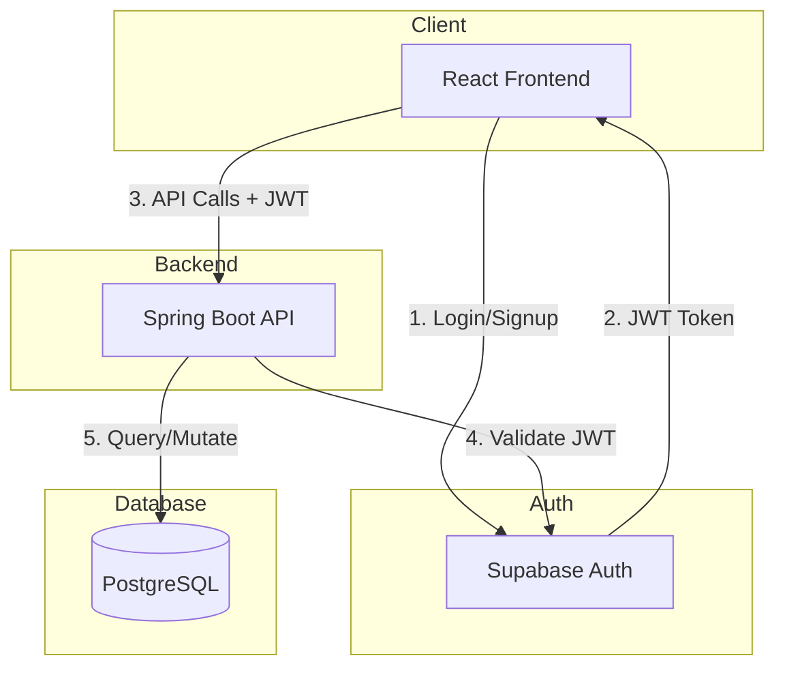
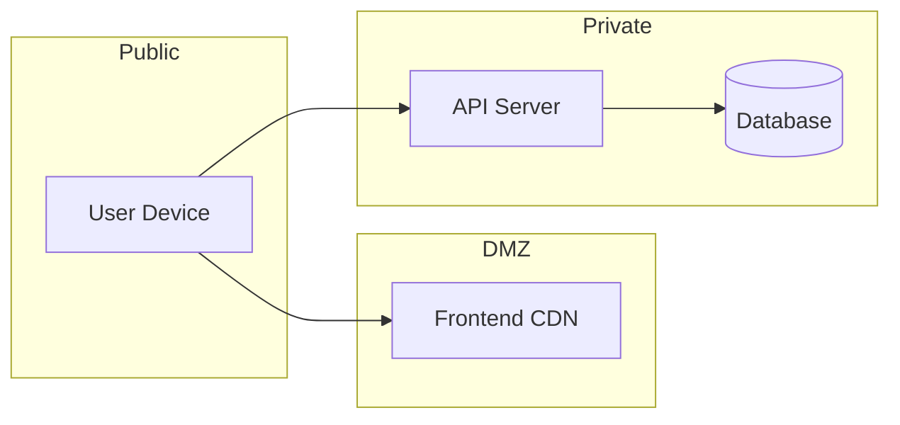

# Architecture Overview

Navilla follows a three-tier architecture with a React frontend, Spring Boot backend, and Supabase for authentication and database.

## High-Level Architecture

## Request Flow

1. **User authenticates** via Supabase Auth (frontend SDK)
2. **Supabase returns JWT** containing user ID and claims
3. **Frontend includes JWT** in `Authorization` header for API calls
4. **Spring Boot validates JWT** using Supabase's public key
5. **Backend queries PostgreSQL** with Row Level Security enforced

## Component Responsibilities

| Component | Responsibilities |
|-----------|------------------|
| **React Frontend** | UI rendering, user interactions, Supabase Auth integration |
| **Spring Boot API** | Business logic, graph traversal, exposure calculations, encryption |
| **Supabase Auth** | User registration, login, OAuth, JWT issuance |
| **PostgreSQL** | Data persistence, Row Level Security, encrypted storage |

## Key Design Decisions

### Why Supabase for Auth?

- Built-in email verification
- OAuth providers (Google, Apple) out of the box
- JWT tokens with customizable claims
- Free tier supports 50K monthly active users

### Why Spring Boot for Backend?

- Type-safe Java for complex business logic
- Robust ecosystem for encryption, graph algorithms
- Easy JWT validation with Spring Security
- Good PostgreSQL integration

### Why Not Direct Supabase Access?

While Supabase supports direct database access from the frontend with RLS, we chose a dedicated backend because:

1. **Complex graph traversal** - Exposure calculations require multi-step queries
2. **Encryption at application layer** - More control over encryption/decryption
3. **Batching logic** - Notification queuing and weekly batch processing
4. **Future flexibility** - Easier to add caching, rate limiting, etc.

## Security Boundaries

- **Frontend** is publicly accessible, contains no secrets
- **Backend** validates all requests, never trusts client input
- **Database** only accessible from backend, RLS as defense-in-depth
