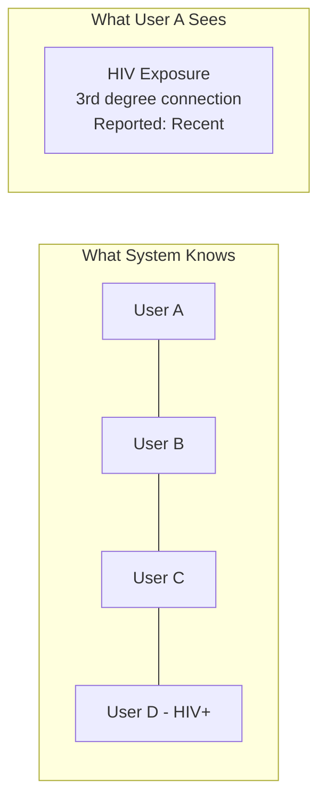
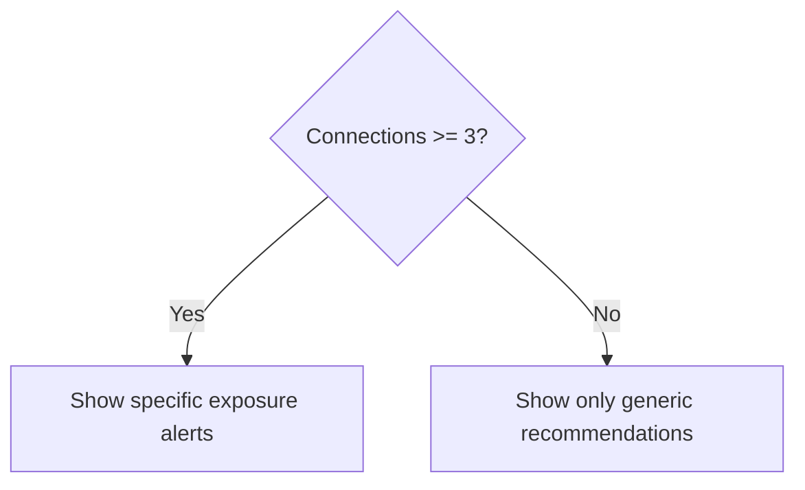

# Privacy Model

Navilla's privacy architecture ensures users can understand their exposure risk without ever learning who may have exposed them.

## Core Principle: Numbers, Not Names

Users see **statistics**, never **identities**.



## Privacy Guarantees

| Guarantee | Implementation |
|-----------|----------------|
| Cannot see specific person's health status | Aggregate statistics only |
| Cannot see who reported positive | Batched, anonymized notifications |
| Cannot determine if person has account | Connection requests don't reveal existence |
| Cannot see why connection was rejected | Generic "not confirmed" response |

## Inference Attack Prevention

### The Single-Connection Problem

If User A has only 1 connection and receives an STI alert, they know with certainty who exposed them.

**Solution: Minimum Threshold**



- Users with < 3 connections see **only** generic health recommendations
- Specific alerts require **3+ confirmed connections**
- Creates plausible deniability

### Timing Attack Prevention

Without protection, a user could:
1. Add one new connection
2. Wait for next notification
3. If new alert appears → new connection has STI

**Solution: Batched Notifications**

```mermaid
gantt
    title Notification Batching
    dateFormat HH:mm
    section Sunday
    Batch Window    :a1, 18:00, 12h
    User 1 receives :milestone, 18:30, 0d
    User 2 receives :milestone, 21:15, 0d
    User 3 receives :milestone, 02:45, 0d
```



- All exposure alerts sent in **weekly batch** (Sunday evening)
- Each notification has **random delay** within batch window
- No correlation between report time and notification time

### Graph Analysis Prevention

Without protection, sophisticated users could:
- Track which connections trigger new exposures
- Deduce health status through graph changes

**Solution: Aggregated Statistics**

```
// What the system computes
exposure = [
  { userId: "abc123", condition: "HIV", degree: 2 },
  { userId: "def456", condition: "HIV", degree: 3 },
]

// What user sees
{
  condition: "HIV",
  count: 2,
  closestDegree: 2,
  timeframe: "recent"
}
```

User never sees individual exposure sources.

## Phone Number Hashing

Phone numbers are used for the phone-match connection paths (auto-match and notification match). Phone privacy is critical because phone numbers are highly identifiable.

### Hashing Strategy

- Phone numbers are **SHA-256 hashed** before storage. The raw phone number is never persisted.
- The hash is stored in `connection_phone_entries.phone_hash` and `encounter_journal.phone_hash`.
- Matching is performed by comparing hashes: if two users log the same phone hash within the configurable date window (`phone_match.window_days`, default +/-2 days), a match is detected.
- Phone hashes are **one-way** and cannot be reversed to recover the original number.

### Abuse Prevention

- **Phone blocks** (`phone_blocks` table): Users can block specific phone hashes. A `UNIQUE(user_hash, blocked_phone_hash)` constraint prevents duplicate blocks.
- **Phone reports** (`phone_reports` table): Users can report abusive phone-match senders with an optional reason (max 200 chars).
- **Rate limiting**: Configurable via `app_config`:
  - `phone_match.max_attempts_per_week` (default 5) limits outbound phone-match attempts per user per week.
  - `phone_match.denial_cooldown_threshold` (default 3) throttles senders after repeated denials.

### What We Don't Store

- Raw phone numbers are never stored anywhere in the database.
- Phone hashes only persist as long as the journal entry or phone entry exists.
- No reverse lookup table exists.

## Push Notification Encryption

Web Push notifications use the VAPID protocol (RFC 8292) with RFC 8030 delivery.

### Subscription Data Protection

Push subscription data is stored in the `push_subscriptions` table with all sensitive fields encrypted at rest:

| Column | Contents | Encryption |
|--------|----------|------------|
| `endpoint_encrypted` | Push service endpoint URL | AES-256-GCM |
| `p256dh_encrypted` | Client public key (P-256 ECDH) | AES-256-GCM |
| `auth_encrypted` | Client authentication secret | AES-256-GCM |

Subscription data is decrypted only at the moment of sending a push notification and is never cached in decrypted form.

### VAPID Authentication

- The server authenticates to push services using VAPID (Voluntary Application Server Identification).
- A VAPID key pair (ES256/P-256) is configured via application properties (`navilla.push.vapid-public-key`, `navilla.push.vapid-private-key`).
- For each push delivery, the server generates a signed JWT with:
  - `aud`: The push service origin (e.g., `https://fcm.googleapis.com`)
  - `exp`: 12 hours from now
  - `sub`: The VAPID subject (contact URI)
- The JWT is signed with ES256 using jose4j and sent as `Authorization: vapid t=<jwt>,k=<publicKey>`.
- The VAPID private key is stored as an environment variable, never in source code.

### Stale Subscription Cleanup

- HTTP 404 or 410 responses from push services indicate stale subscriptions.
- The service returns `false` for these, signaling the caller to delete the subscription.
- This prevents accumulation of dead subscription records.

### Current Limitations

- RFC 8291 payload encryption (aes128gcm) is not yet implemented. Push messages are sent with plaintext JSON payloads. Full content encryption using the subscriber's p256dh and auth keys will be added when a compatible Java library is integrated.
- Until then, push notification content should not include sensitive health data. Current payloads contain only notification type, i18n message key, and a frontend route URL.

## Lab Verification Data Protection

The lab verification system (migration 015) introduces sensitive data flows between Navilla and external lab providers. Privacy protections are layered.

### Credential Handling

Lab credentials are stored in the `lab_credentials` table using an EAV (Entity-Attribute-Value) pattern:

```
lab_credentials
  lab_id       → FK to labs table
  credential_key  → plaintext key name (e.g., "patient_id", "account_number")
  value_encrypted → AES-256-GCM encrypted credential value
```

- Credential values are **never stored in plaintext**.
- Credential keys (field names) are stored in plaintext because they are non-sensitive metadata (e.g., "patient_id").
- Each lab can have multiple credentials, constrained by `UNIQUE(lab_id, credential_key)`.
- Credentials are decrypted only when making an API call to the lab provider, then immediately discarded from memory.

### Lab Verification Flow Privacy

The two-step verification flow protects user data:

1. **Verify step**: User provides visit credentials (e.g., order number) and lab credentials. The backend calls the lab provider API, receives results, and caches them in memory (not database) keyed by `userHash:visitId`. The raw lab response is not persisted at this stage.

2. **Confirm step**: User reviews the results and explicitly confirms. Only then are results saved:
   - Test results are stored in `test_results` with encrypted result values.
   - The raw lab API response is Base64-encoded, AES-256-GCM encrypted, and stored in `test_visits.raw_lab_response_encrypted` for audit purposes.
   - The visit is marked as `verified = true` with a `verified_at` timestamp.
   - Health status is automatically synced for recognized condition codes.

### What Gets Encrypted

| Data | Column | Encryption |
|------|--------|------------|
| Lab name | `labs.name_encrypted` | AES-256-GCM |
| Lab credentials | `lab_credentials.value_encrypted` | AES-256-GCM |
| Lab reference (order #) | `test_visits.lab_reference_encrypted` | AES-256-GCM |
| Visit notes | `test_visits.notes_encrypted` | AES-256-GCM |
| Raw lab API response | `test_visits.raw_lab_response_encrypted` | AES-256-GCM |
| Test result values | `test_results.result_value_encrypted` | AES-256-GCM |
| Custom condition names | `test_results.custom_condition_encrypted` | AES-256-GCM |
| Document references | `test_results.document_ref_encrypted` | AES-256-GCM |

### What Stays Plaintext

- `labs.provider` (e.g., "chopo", "salud_digna") — non-sensitive provider identifier
- `lab_credentials.credential_key` — non-sensitive field name metadata
- `test_results.condition_type` — standardized condition code (e.g., "CHLAMYDIA"), needed for queries
- `test_results.status` — result status (POSITIVE/NEGATIVE/PENDING/INDETERMINATE), needed for health_status sync
- `test_results.reference_range` — public medical reference ranges (e.g., "0-1.0 IU/mL")

## Data Minimization

### What We Store

| Data | Why Needed | Retention |
|------|------------|-----------|
| Email hash | Account lookup | Account lifetime |
| Email encrypted | Account recovery | Account lifetime |
| Connections | Graph traversal | Account lifetime |
| Health status | Exposure calculation | Until cleared + 1 year |
| Snapshots | Performance | Configurable (default 7 days) |
| Journal entries | Personal tracking | User-configurable auto-deletion |
| Test visits/results | Health history | Account lifetime |
| Lab credentials | Lab API access | Until user deletes lab |
| Medications | Adherence tracking | Account lifetime |
| Vaccinations | Dose tracking | Account lifetime |
| Push subscriptions | Notification delivery | Until unsubscribed or stale |
| Phone hashes | Connection matching | Until journal entry deleted |
| Raw lab responses | Audit trail | Account lifetime |

### What We Don't Store

- Real names (display names optional, user-chosen)
- Raw phone numbers (only SHA-256 hashes)
- Location data (vaccination location is optional, encrypted)
- IP addresses (beyond access logs)
- Device identifiers (beyond push subscription endpoints)
- Exact test dates in exposure alerts (approximate only)
- Lab API session tokens (used and discarded)

## User Controls

### Connection Management

Users can:
- Remove connections (affects their view only, not partner's history)
- Delete account (removes all their data)
- Block phone hashes to prevent matching
- Report abusive phone-match attempts

Users cannot:
- See partner's health status
- See who didn't confirm connection
- Reverse phone hashes to learn numbers

### Notification Preferences

Users can:
- Opt out of push notifications (delete all subscriptions)
- Control email digest frequency and day
- Toggle reminder categories (testing, medication, vaccination)
- Set quiet hours for reminder delivery

### Reciprocity Controls

Users can:
- Opt in to the exposure network (contribute test data to see exposure data)
- Opt out at any time (loses access to exposure data)
- Re-opt-in after a 15-day cooldown period (configurable via `app_config`)
- Choose whether to receive phone-match notifications (`receive_match_notifications`)

Users cannot:
- See exposure data without contributing (reciprocity enforced)
- Bypass the cooldown period after opting out

## Legal Compliance

### GDPR (EU Users)

- **Right to access**: Export all personal data
- **Right to erasure**: Delete account and all data
- **Right to portability**: Export in machine-readable format
- **Data minimization**: Only collect what's necessary

### HIPAA Considerations

Navilla now integrates with external lab providers for test result verification. While Navilla is not a covered entity under HIPAA, the lab verification flow handles protected health information (PHI) and follows HIPAA-like practices:

- Encryption at rest (AES-256-GCM) and in transit (TLS)
- Access controls and audit logging
- Minimum necessary access principle
- Raw lab responses encrypted and stored for audit
- Lab credentials encrypted with same protections as health data
- No PHI in push notification payloads

Full HIPAA compliance assessment may be needed as lab integrations expand.

## Threat Model

### Protected Against

- Curious users trying to identify partners' status
- Database breach revealing user identities or phone numbers
- Timing attacks via notification analysis
- Social engineering via connection requests
- Push subscription endpoint harvesting (encrypted at rest)
- Lab credential theft from database (encrypted at rest)
- Phone number reverse lookup (one-way SHA-256 hash)

### Out of Scope (MVP)

- State-level adversaries
- Compromised user devices
- Users sharing screenshots
- Side-channel attacks on encrypted data
- Lab provider API compromise (trusted third party)
- Push service provider compromise (trusted third party)

### Trust Assumptions

- Backend server is trusted (runs our code)
- Supabase is trusted (handles auth, stores encrypted data)
- TLS endpoints are not compromised
- Lab provider APIs are trusted (Chopo, Salud Digna, etc.)
- Push service providers are trusted (Google FCM, Mozilla, Apple)
