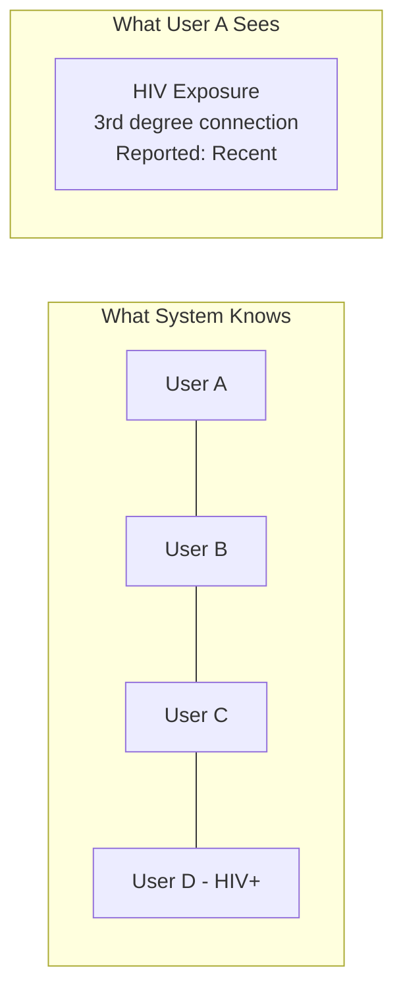
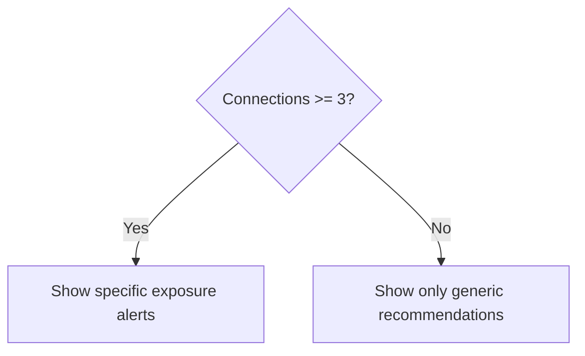

# Privacy Model

Navilla's privacy architecture ensures users can understand their exposure risk without ever learning who may have exposed them.

## Core Principle: Numbers, Not Names

Users see **statistics**, never **identities**.



## Privacy Guarantees

| Guarantee | Implementation |
|-----------|----------------|
| Cannot see specific person's health status | Aggregate statistics only |
| Cannot see who reported positive | Batched, anonymized notifications |
| Cannot determine if person has account | Connection requests don't reveal existence |
| Cannot see why connection was rejected | Generic "not confirmed" response |

## Inference Attack Prevention

### The Single-Connection Problem

If User A has only 1 connection and receives an STI alert, they know with certainty who exposed them.

**Solution: Minimum Threshold**



- Users with < 3 connections see **only** generic health recommendations
- Specific alerts require **3+ confirmed connections**
- Creates plausible deniability

### Timing Attack Prevention

Without protection, a user could:
1. Add one new connection
2. Wait for next notification
3. If new alert appears → new connection has STI

**Solution: Batched Notifications**


- All exposure alerts sent in **weekly batch** (Sunday evening)
- Each notification has **random delay** within batch window
- No correlation between report time and notification time

### Graph Analysis Prevention

Without protection, sophisticated users could:
- Track which connections trigger new exposures
- Deduce health status through graph changes

**Solution: Aggregated Statistics**

```
// What the system computes
exposure = [
  { userId: "abc123", condition: "HIV", degree: 2 },
  { userId: "def456", condition: "HIV", degree: 3 },
]

// What user sees
{
  condition: "HIV",
  count: 2,
  closestDegree: 2,
  timeframe: "recent"
}
```

User never sees individual exposure sources.

## Data Minimization

### What We Store

| Data | Why Needed | Retention |
|------|------------|-----------|
| Email hash | Account lookup | Account lifetime |
| Email encrypted | Account recovery | Account lifetime |
| Connections | Graph traversal | Account lifetime |
| Health status | Exposure calculation | Until cleared + 1 year |
| Snapshots | Performance | 1 week (cached) |

### What We Don't Store

- Real names (display names optional, user-chosen)
- Location data
- IP addresses (beyond access logs)
- Device identifiers
- Exact test dates (approximate only)

## User Controls

### Connection Management

Users can:
- ✅ Remove connections (affects their view only, not partner's history)
- ✅ Delete account (removes all their data)
- ❌ See partner's health status
- ❌ See who didn't confirm connection

### Notification Preferences

Users can:
- ✅ Opt out of push notifications
- ✅ Control email frequency
- ❌ Opt out of exposure calculation (if you have connections, you're in the graph)

## Legal Compliance

### GDPR (EU Users)

- **Right to access**: Export all personal data
- **Right to erasure**: Delete account and all data
- **Right to portability**: Export in machine-readable format
- **Data minimization**: Only collect what's necessary

### HIPAA Considerations

Navilla does **not** integrate directly with healthcare providers in MVP, so may not be covered by HIPAA. However, we follow HIPAA-like practices:

- Encryption at rest and in transit
- Access controls and audit logging
- Minimum necessary access principle

Future lab integrations would require full HIPAA compliance.

## Threat Model

### Protected Against

- ✅ Curious users trying to identify partners' status
- ✅ Database breach revealing user identities
- ✅ Timing attacks via notification analysis
- ✅ Social engineering via connection requests

### Out of Scope (MVP)

- ❌ State-level adversaries
- ❌ Compromised user devices
- ❌ Users sharing screenshots
- ❌ Side-channel attacks on encrypted data

### Trust Assumptions

- Backend server is trusted (runs our code)
- Supabase is trusted (handles auth, stores encrypted data)
- TLS endpoints are not compromised
