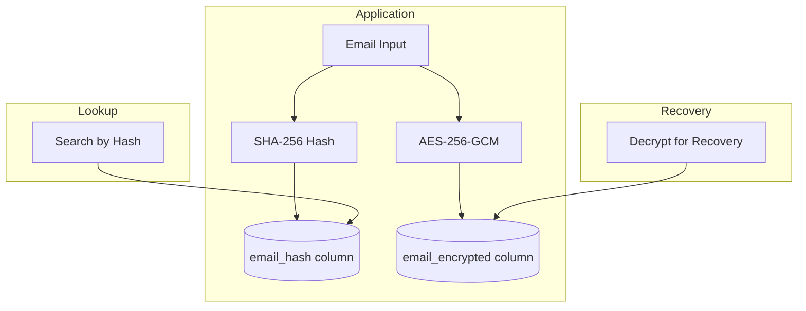
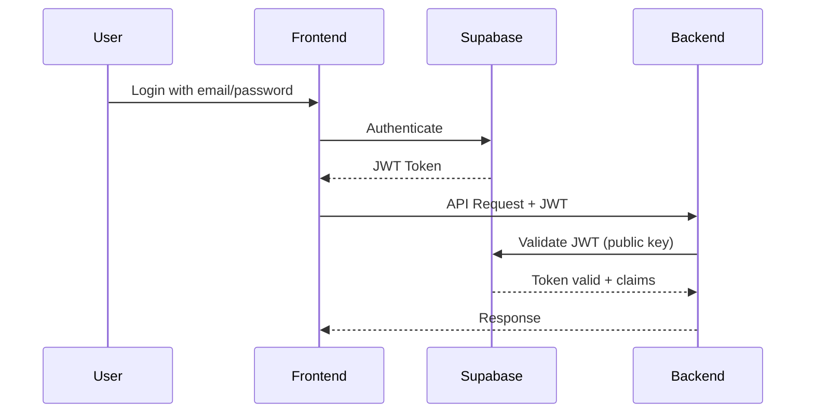

# Security Architecture

Security measures protecting Navilla users and data.

## Encryption

### Data at Rest



| Data Type | Algorithm | Key Management |
|-----------|-----------|----------------|
| Email (lookup) | SHA-256 + pepper | Application secret |
| Email (recovery) | AES-256-GCM | Per-user key |
| Display name | AES-256-GCM | Per-user key |
| Health records | AES-256-GCM | Per-user key |
| Exposure snapshots | AES-256-GCM | Per-user key |

### Data in Transit

- All connections use **TLS 1.3**
- HSTS headers enforced
- Certificate pinning (mobile apps, future)

### Key Derivation

```java
// Per-user encryption key derivation
public byte[] deriveUserKey(String userId) {
    return Hkdf.extract(
        applicationSecret,    // IKM
        userId.getBytes(),    // Salt
        "navilla-user-key"    // Info
    );
}
```

## Authentication

### Supabase Auth Integration



### JWT Validation

```java
@Configuration
public class SecurityConfig {
    @Bean
    public SecurityFilterChain filterChain(HttpSecurity http) {
        return http
            .oauth2ResourceServer(oauth2 -> oauth2
                .jwt(jwt -> jwt
                    .jwkSetUri(supabaseJwkUri)
                )
            )
            .build();
    }
}
```

### Session Management

- JWT tokens expire after **1 hour**
- Refresh tokens expire after **7 days**
- Refresh token rotation enabled
- Single-use refresh tokens (replay detection)

## Authorization

### Row Level Security (RLS)

Database-level access control as defense-in-depth:

```sql
-- Users can only access their own records
CREATE POLICY own_data_only ON users
    FOR ALL
    USING (email_hash = current_user_hash());

-- Even if application has bug, database enforces access
```

### API Authorization

```java
@PreAuthorize("@userService.isOwner(#userId, authentication)")
public HealthStatus getHealthStatus(@PathVariable String userId) {
    // Only accessible if user owns this data
}
```

## Input Validation

### Email Validation

```java
public void validateEmail(String email) {
    // Format validation
    if (!EMAIL_PATTERN.matcher(email).matches()) {
        throw new InvalidEmailException();
    }

    // Length limits
    if (email.length() > 254) {
        throw new InvalidEmailException();
    }

    // No special characters that could be injected
    if (containsInjectionPatterns(email)) {
        throw new InvalidEmailException();
    }
}
```

### SQL Injection Prevention

- All queries use **parameterized statements**
- No dynamic SQL construction
- ORM (JPA/Hibernate) for most queries

### XSS Prevention

- React escapes output by default
- Content Security Policy headers
- No `dangerouslySetInnerHTML` usage

## Rate Limiting

| Endpoint | Limit | Window |
|----------|-------|--------|
| Login attempts | 5 | 15 minutes |
| Connection requests | 10 | 1 hour |
| Health status updates | 5 | 1 hour |
| API calls (general) | 100 | 1 minute |

```java
@RateLimited(limit = 5, window = "15m", key = "ip")
public AuthResponse login(LoginRequest request) {
    // ...
}
```

## Audit Logging

### What We Log

```json
{
  "timestamp": "2026-01-30T10:30:00Z",
  "action": "HEALTH_STATUS_UPDATED",
  "userHash": "abc123...",
  "ipHash": "def456...",
  "outcome": "SUCCESS"
}
```

### What We Don't Log

- Actual email addresses
- Specific health conditions (only "updated")
- Connection partner identities
- Full IP addresses (hashed only)

### Log Retention

- Access logs: 90 days
- Security events: 1 year
- Audit trail: 7 years (legal compliance)

## Incident Response

### Severity Levels

| Level | Description | Response Time |
|-------|-------------|---------------|
| P1 | Data breach, system compromise | Immediate |
| P2 | Service outage, auth failure | 1 hour |
| P3 | Performance degradation | 4 hours |
| P4 | Minor issues | Next business day |

### Breach Response Plan

1. **Contain**: Isolate affected systems
2. **Assess**: Determine scope of breach
3. **Notify**: Inform affected users within 72 hours (GDPR)
4. **Remediate**: Fix vulnerability
5. **Review**: Post-incident analysis

## Security Headers

```
Strict-Transport-Security: max-age=31536000; includeSubDomains
Content-Security-Policy: default-src 'self'; script-src 'self'
X-Content-Type-Options: nosniff
X-Frame-Options: DENY
Referrer-Policy: strict-origin-when-cross-origin
Permissions-Policy: geolocation=(), microphone=(), camera=()
```

## Dependency Security

- Dependabot enabled for all repositories
- Weekly dependency audits
- No known vulnerabilities policy (CI blocks merge)

```yaml
# .github/workflows/security.yml
- name: Security Audit
  run: |
    npm audit --audit-level=moderate
    ./gradlew dependencyCheckAnalyze
```
