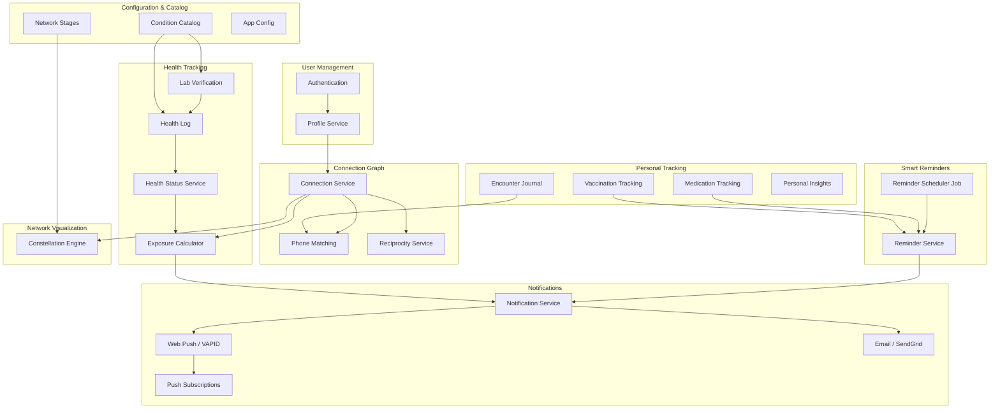
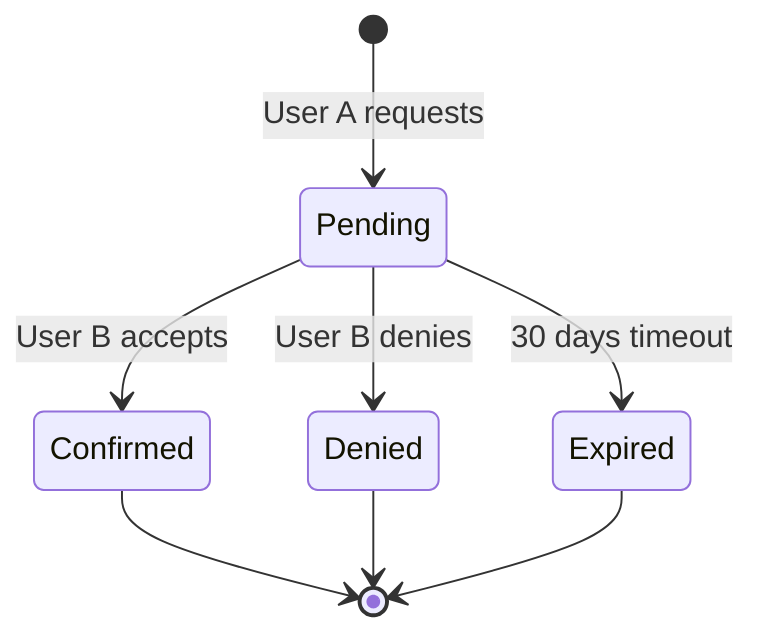
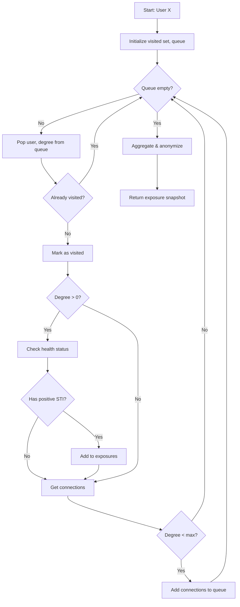
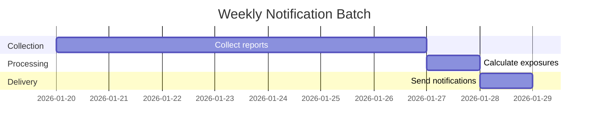

# System Design

Detailed system design for Navilla's core functionality.

## Core Subsystems



Navilla is composed of approximately 19 subsystems organized into 8 functional groups. Each subsystem is implemented as one or more Spring Boot `@Service` classes with a corresponding `@RestController`.

## Subsystem Descriptions

### User Management

- **Authentication (Auth)**: Supabase Auth handles sign-up, login, password reset, and JWT issuance. The backend validates Supabase JWTs on every authenticated request using Spring Security's OAuth2 resource server support.
- **User/Profile Service** (`UserController`, `UserService`): Lazy-sync model where users are created in the application database on first API call. Supports profile updates, user search, and account deletion (soft delete).

### Connection Graph

- **Connection Service** (`ConnectionController`, `ConnectionService`): Manages bidirectional connections (encounters) between users. Supports explicit request/accept/deny/cancel lifecycle. Connections now track their formation type (`PHONE_MATCH`, `NOTIFICATION_MATCH`, `EXPLICIT`, `LINK`).
- **Phone Matching** (`PhoneMatchService`, `PhoneNotificationMatchService`): Two phone-based connection paths. *Auto-match*: mutual phone hash logging within a configurable date window (default +/-2 days) creates an implicit connection. *Notification match*: one-sided phone log triggers a masked notification to the phone owner who can confirm or deny. Phone hashes are SHA-256 with no reversibility.
- **Reciprocity Service** (`ReciprocityController`, `ReciprocityService`): Manages the soft opt-in/opt-out lifecycle for the exposure network. Users must contribute test data to see exposure data. Opting out triggers a configurable cooldown period (default 15 days) before re-opt-in is allowed. State tracked via `exposure_opted_in`, `exposure_opted_in_at`, and `exposure_opted_out_at` columns on `users`.

### Health Tracking

- **Health Status Service** (`HealthStatusController`, `HealthStatusService`): Maintains the current health status per condition per user (positive/negative/unknown). Updated manually or automatically via lab verification.
- **Health Log** (`HealthLogController`, `HealthLogService`, `LabService`): Full test visit history with per-condition results. Supports CRUD for test visits, test results, labs, and lab credentials. Provides summary statistics and per-condition history. Cached with a 5-minute TTL (`healthLogSummary`).
- **Lab Verification** (`LabProviderController`, `LabVerificationService`): Two-step verification flow: (1) call lab provider API with credentials, cache results; (2) user confirms and results are persisted. Supports pluggable lab providers via `LabProviderRegistry`. Verified results auto-sync to `health_status`. Raw lab responses are encrypted and stored for audit.
- **Exposure Calculator** (`ExposureController`, `ExposureService`): BFS graph traversal algorithm that computes exposure risk from the connection graph. Results are aggregated and anonymized to prevent identification. Cached as encrypted snapshots with configurable TTL.

### Personal Tracking

- **Encounter Journal** (`EncounterJournalController`, `EncounterJournalService`): Encrypted personal encounter diary. Each entry records date, partner (alias or linked partner), notes, custom fields (max 3), encounter types, and protection methods. Supports custom field templates and yearly summaries.
- **Journal Partners** (`JournalPartnerController`, `JournalPartnerService`): Recurring partner management for the encounter journal. Partners have an encrypted alias and optional notes. Can be linked to a connection. Entries can reference a saved partner instead of a freeform alias.
- **Medication Tracking** (`MedicationController`, `MedicationService`): CRUD for active medications (PrEP, antibiotics, antivirals, etc.). Daily dose logging with adherence statistics by month. PrEP streak tracking with milestone badges. Cached with a 10-minute TTL (`prepStreak`).
- **Vaccination Tracking** (`VaccinationController`, `VaccinationService`): Multi-dose vaccine series tracking (HPV, Hepatitis A/B, Mpox). Records individual doses with date, location, and notes. Groups doses by vaccine type and shows completion progress.
- **Personal Insights** (`InsightsController`, `InsightsService`): Aggregated dashboard combining activity metrics (encounter frequency), testing metrics (visit frequency, days since last test), and prevention metrics (medication adherence, PrEP streak). Cached with a 5-minute TTL (`insights`).

### Smart Reminders

- **Reminder Service** (`ReminderController`, `ReminderService`): Unified reminder system covering testing schedules, medication doses, vaccination follow-ups, and custom reminders. Supports snooze, complete, toggle active, and delete operations. Per-user settings include quiet hours, email digest preferences, and per-category toggles.
- **Reminder Scheduler** (`ReminderSchedulerJob`, `ReminderCalculationEngine`): Background scheduled job that evaluates active reminders and fires notifications when due. Respects quiet hours and user preferences.

### Notifications

- **Notification Service** (`NotificationController`, `NotificationService`): Central notification hub. Creates in-app notifications with encrypted payloads. Supports connection events, exposure alerts, reminder notifications, and account security alerts. Every in-app notification also triggers a fire-and-forget web push.
- **Push Subscriptions** (`PushSubscriptionController`, `PushSubscriptionService`): Manages Web Push subscription lifecycle (subscribe, unsubscribe, list). Subscription data (endpoint, p256dh, auth) is AES-256-GCM encrypted at rest.
- **Web Push (VAPID)** (`WebPushService`): Sends push notifications per RFC 8292 (VAPID) and RFC 8030. Uses jose4j for ES256 JWT signing. VAPID key pair configured via application properties. Handles stale subscription cleanup (HTTP 404/410).
- **Email (SendGrid)** (`EmailService`, `EmailTemplateService`): Sends templated HTML emails via SendGrid HTTP API v3 over HTTPS (port 443). Railway blocks all SMTP ports, so HTTP API is mandatory. Fire-and-forget with graceful degradation when disabled or unconfigured.

### Configuration & Catalog

- **Condition Catalog** (`CatalogController`, `ConditionCatalogService`): Database-driven catalog of STI conditions, replacing hardcoded enums. Supports bilingual display names (en/es), icons, and display ordering. Cached with 1-hour TTL (`catalog`).
- **Network Stages** (`NetworkStageService`): Configurable constellation stage thresholds (Empty Sky, Spark, Cluster, Constellation, Galaxy, Supercluster). Bilingual names and descriptions. Cached alongside the catalog.
- **App Config** (`AppConfigService`): Runtime key-value configuration store. Controls phone match windows, reciprocity cooldowns, exposure thresholds, verification settings, and more. Cached with 1-hour TTL (`appConfig`). No redeployment needed to change values.

### Network Visualization

- **Constellation Engine** (frontend `lib/visualization/`): Pluggable visualization architecture for network constellation display. Canvas 2D engine is the first implementation. `VisualizationEngine` interface provides `mount()`, `update()`, `exportImage()`, and `destroy()` methods. Engines are swappable by changing one import.

## Caching Layer

Navilla uses **Caffeine** (in-process) for application-level caching with `@EnableCaching` and Spring's `@Cacheable` annotation. Five named caches with individual TTLs:

| Cache Name | Scope | TTL | Max Size | Used By |
|------------|-------|-----|----------|---------|
| `catalog` | Global | 1 hour | 1 | Condition catalog, network stages, health catalog |
| `appConfig` | Global | 1 hour | 200 | Runtime configuration key-value pairs |
| `healthLogSummary` | Per-user | 5 minutes | 500 | Health log summary statistics |
| `insights` | Per-user | 5 minutes | 500 | Personal insights dashboard |
| `prepStreak` | Per-user | 10 minutes | 500 | PrEP adherence streak data |

Cache eviction is TTL-based (expire after write). No distributed cache is needed at current scale since the backend runs as a single Railway instance.

## Connection System

### Connection States



### Connection Paths

There are four ways to form a connection:

1. **Phone auto-match (mainstream)**: Both users log the same phone hash within +/-2 days. Mutual logging implies consent. Automatically creates a confirmed connection.
2. **Phone notification match (opt-in)**: One-sided phone log triggers a masked notification to the phone number owner. Recipient confirms or denies. Requires `receive_match_notifications = true` on the recipient.
3. **Explicit request**: User A sends a connection request via email, link, or username. User B accepts or denies.
4. **Journal-only**: Personal journal entry without any connection. No partner notification.

### Connection Request Flow

1. User A submits connection request with User B's email
2. System hashes email to check if User B exists
3. If exists: In-app notification sent to User B
4. If not exists: Invitation email sent (no details about who/why)
5. User B can confirm, deny, or ignore
6. User A never learns outcome details (only "not confirmed")

## Exposure Calculation

### Graph Traversal Algorithm



### Exposure Aggregation

Raw exposure data is aggregated to prevent identification:

```
Input:
  - Degree 1: Chlamydia (reported 2026-01-15)
  - Degree 2: Chlamydia (reported 2026-01-10)
  - Degree 2: HIV (reported 2025-12-01)

Output (user sees):
  - Chlamydia: 2 potential exposures (closest: 1st degree, recent)
  - HIV: 1 potential exposure (2nd degree, older)
```

## Notification System

### Delivery Channels

Navilla uses three notification channels:

1. **In-app notifications**: Persisted to the `notifications` table with encrypted payloads. Displayed in the notification center. Support mark-as-read and mark-all-read.
2. **Web Push (VAPID/RFC 8030)**: Real-time push to subscribed browsers/PWA via `WebPushService`. Uses ES256-signed VAPID JWTs (jose4j). Subscription data (endpoint, p256dh, auth keys) stored encrypted. Stale subscriptions auto-cleaned on HTTP 404/410.
3. **Email (SendGrid HTTP API v3)**: Templated HTML emails sent over HTTPS port 443. Railway blocks SMTP ports (587, 2525, 465), so the HTTP API is mandatory. Fire-and-forget with template rendering via `EmailTemplateService`.

### Notification Types

| Type | Channel | Trigger |
|------|---------|---------|
| `CONNECTION_REQUEST` | In-app + Push | New connection request received |
| `CONNECTION_CONFIRMED` | In-app + Push | Connection accepted |
| `CONNECTION_DENIED` | In-app + Push | Connection denied |
| `EXPOSURE_ALERT` | In-app + Push | New exposure detected (batched) |
| `EXPOSURE_CLEARED` | In-app + Push | Exposure condition cleared |
| `ACCOUNT_SECURITY` | In-app + Push | Security-related events |
| `MEDICATION_REMINDER` | In-app + Push | Medication dose due |
| `VACCINATION_REMINDER` | In-app + Push | Vaccination dose due |
| `TESTING_REMINDER` | In-app + Push | Testing schedule reminder |
| `FOLLOW_UP_REMINDER` | In-app + Push | Follow-up appointment reminder |

### Batching Strategy



- **Immediate**: Connection requests, confirmations, reminder alerts (in-app + push)
- **Weekly**: Exposure alerts (Sunday evening batch)
- **Randomized**: Exposure notifications within batch window have random delay (+/-6 hours)

### Why Batching?

1. **Privacy**: Makes timing attacks harder
2. **Performance**: Batch graph calculations are more efficient
3. **User experience**: Weekly digest vs constant alerts

## Email System

### Architecture

```
EmailService (SendGrid HTTP API v3)
  |
  +-- EmailTemplateService (Thymeleaf-like rendering)
  |     +-- Templates: digest, reminder, welcome, etc.
  |     +-- Locale-aware (en_US, es_MX)
  |
  +-- HttpClient (Java 25, HTTPS port 443)
        +-- POST https://api.sendgrid.com/v3/mail/send
        +-- Bearer token: SENDGRID_API_KEY
        +-- Sender: no-reply@navilla.app
```

- **Why not SMTP?** Railway blocks all outbound SMTP ports (587, 2525, 465). SendGrid HTTP API over HTTPS port 443 is the only path.
- **Fire-and-forget**: Email failures are logged but never propagated to callers. A broken mail provider cannot disrupt user operations.
- **Disable-safe**: When `navilla.email.enabled=false`, all sends are silently skipped. Safe for local development.

## Encryption Strategy

### Data at Rest

| Data | Encryption | Key Management |
|------|------------|----------------|
| Email (for lookup) | SHA-256 + salt | Static application salt |
| Email (for recovery) | AES-256-GCM | Per-user derived key |
| Health records | AES-256-GCM | Per-user derived key |
| Connection graph | Hashed IDs only | N/A |
| Journal entries | AES-256-GCM | Per-user derived key |
| Lab credentials | AES-256-GCM | Per-user derived key |
| Push subscriptions | AES-256-GCM | Per-user derived key |
| Medication/vaccination data | AES-256-GCM | Per-user derived key |
| Phone numbers | SHA-256 (one-way hash) | N/A |
| Raw lab responses | AES-256-GCM | Per-user derived key |

### Key Derivation

```
User Master Key = HKDF(
    input_key_material = user_password_hash,
    salt = user_id,
    info = "navilla-user-encryption"
)
```

Note: Since we use Supabase Auth, we don't have direct access to passwords. Alternative approaches:
1. Derive from Supabase user ID + application secret
2. Generate random key stored encrypted by Supabase
3. Use Supabase Vault (if available)
