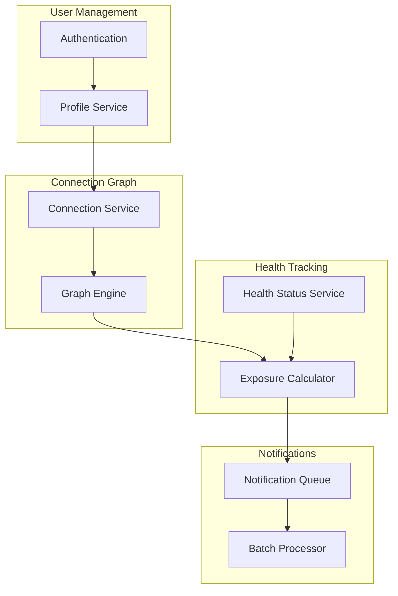
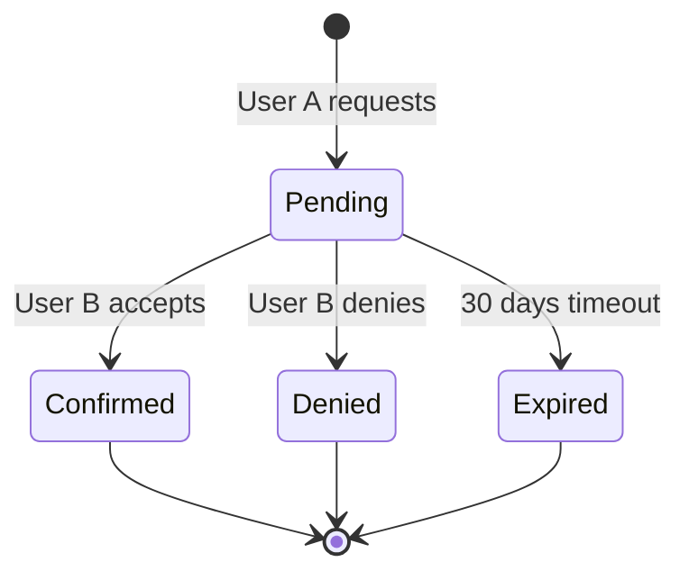
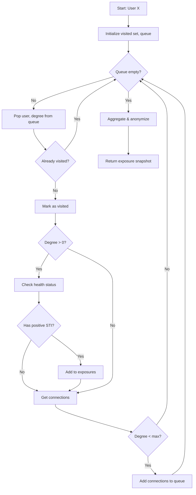
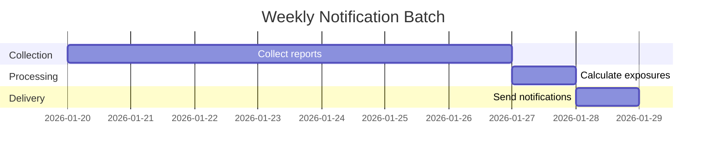

# System Design

Detailed system design for Navilla's core functionality.

## Core Subsystems



## Connection System

### Connection States



### Connection Request Flow

1. User A submits connection request with User B's email
2. System hashes email to check if User B exists
3. If exists: In-app notification sent to User B
4. If not exists: Invitation email sent (no details about who/why)
5. User B can confirm, deny, or ignore
6. User A never learns outcome details (only "not confirmed")

## Exposure Calculation

### Graph Traversal Algorithm



### Exposure Aggregation

Raw exposure data is aggregated to prevent identification:

```
Input:
  - Degree 1: Chlamydia (reported 2026-01-15)
  - Degree 2: Chlamydia (reported 2026-01-10)
  - Degree 2: HIV (reported 2025-12-01)

Output (user sees):
  - Chlamydia: 2 potential exposures (closest: 1st degree, recent)
  - HIV: 1 potential exposure (2nd degree, older)
```

## Notification System

### Batching Strategy



- **Daily**: Connection requests, confirmations (immediate)
- **Weekly**: Exposure alerts (Sunday evening batch)
- **Randomized**: Notifications within batch window have random delay (±6 hours)

### Why Batching?

1. **Privacy**: Makes timing attacks harder
2. **Performance**: Batch graph calculations are more efficient
3. **User experience**: Weekly digest vs constant alerts

## Encryption Strategy

### Data at Rest

| Data | Encryption | Key Management |
|------|------------|----------------|
| Email (for lookup) | SHA-256 + salt | Static application salt |
| Email (for recovery) | AES-256-GCM | Per-user derived key |
| Health records | AES-256-GCM | Per-user derived key |
| Connection graph | Hashed IDs only | N/A |

### Key Derivation

```
User Master Key = HKDF(
    input_key_material = user_password_hash,
    salt = user_id,
    info = "navilla-user-encryption"
)
```

Note: Since we use Supabase Auth, we don't have direct access to passwords. Alternative approaches:
1. Derive from Supabase user ID + application secret
2. Generate random key stored encrypted by Supabase
3. Use Supabase Vault (if available)
