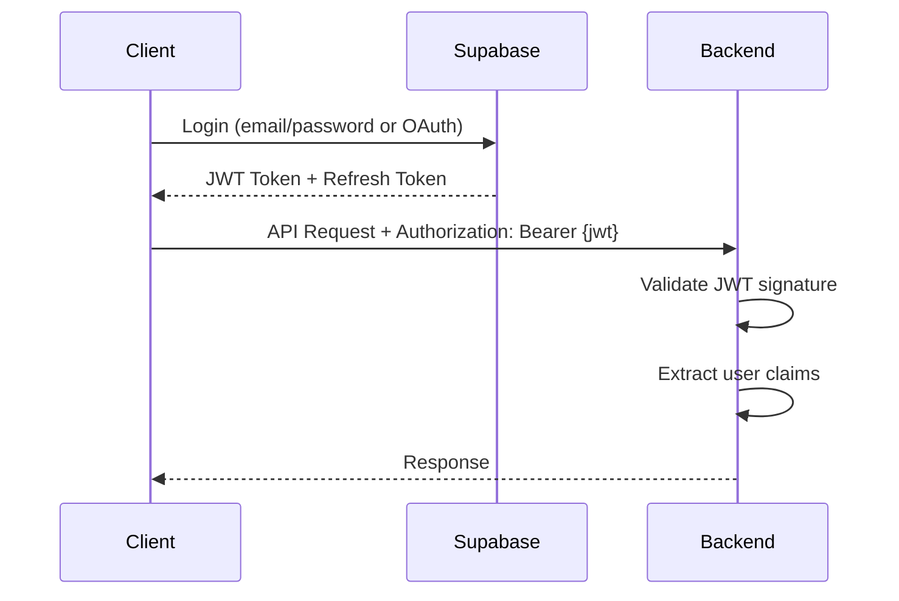

# Authentication

How authentication works in the Navilla backend.

:::note Work in Progress
Implementation details will be added as the backend is built.
:::

## Overview

Navilla uses Supabase for authentication. The backend validates JWT tokens issued by Supabase.

## Flow



## JWT Validation

The backend validates JWTs using Supabase's JWKS (JSON Web Key Set):

```java
@Configuration
@EnableWebSecurity
public class SecurityConfig {

    @Value("${supabase.jwt.jwk-set-uri}")
    private String jwkSetUri;

    @Bean
    public SecurityFilterChain filterChain(HttpSecurity http) throws Exception {
        return http
            .authorizeHttpRequests(auth -> auth
                .requestMatchers("/api/health").permitAll()
                .requestMatchers("/api/**").authenticated()
            )
            .oauth2ResourceServer(oauth2 -> oauth2
                .jwt(jwt -> jwt.jwkSetUri(jwkSetUri))
            )
            .build();
    }
}
```

## User Resolution

After JWT validation, the user is resolved:

```java
@Service
public class UserService {

    public User getCurrentUser(Authentication authentication) {
        String supabaseUserId = authentication.getName();
        String userHash = hashUserId(supabaseUserId);
        return userRepository.findByEmailHash(userHash)
            .orElseThrow(() -> new UserNotFoundException());
    }
}
```

## Endpoints

| Endpoint | Auth Required |
|----------|---------------|
| `GET /api/health` | No |
| `GET /api/users/me` | Yes |
| `POST /api/connections` | Yes |
| `GET /api/exposures` | Yes |
