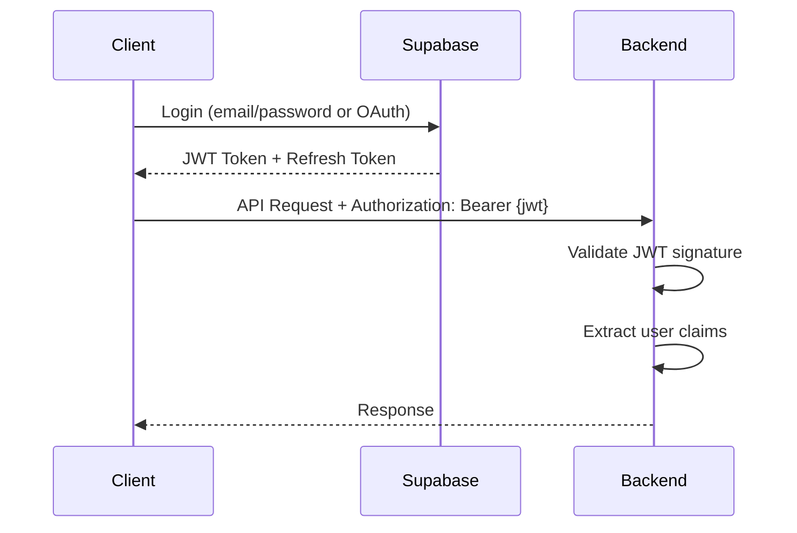

--- 
sidebar_position: 3
title: Authentication
---

# Authentication

How authentication works in the Navilla backend.

## Overview

Navilla uses Supabase for authentication. The backend validates JWT tokens issued by Supabase.

## Flow



## JWT Validation

The backend validates JWTs using Supabase's JWKS (JSON Web Key Set). This is configured in `SecurityConfig.java`:

```java
import org.springframework.beans.factory.annotation.Value;
import org.springframework.context.annotation.Bean;
import org.springframework.context.annotation.Configuration;
import org.springframework.security.config.annotation.web.builders.HttpSecurity;
import org.springframework.security.oauth2.jose.jws.SignatureAlgorithm;
import org.springframework.security.oauth2.jwt.JwtDecoder;
import org.springframework.security.oauth2.jwt.NimbusJwtDecoder;
import org.springframework.security.web.SecurityFilterChain;

@Configuration
public class SecurityConfig {

    @Value("${navilla.supabase.url}")
    private String supabaseUrl;

    @Bean
    public SecurityFilterChain filterChain(HttpSecurity http) throws Exception {
        return http
            .authorizeHttpRequests(auth -> auth
                .requestMatchers("/api/health").permitAll()
                .requestMatchers("/api/**").authenticated()
            )
            .oauth2ResourceServer(oauth2 -> oauth2
                .jwt(jwt -> jwt.decoder(jwtDecoder()))
            )
            .build();
    }

    @Bean
    public JwtDecoder jwtDecoder() {
        String jwksUri = supabaseUrl + "/auth/v1/.well-known/jwks.json";
        return NimbusJwtDecoder.withJwkSetUri(jwksUri)
            .jwsAlgorithm(SignatureAlgorithm.ES256) // Explicitly set for Supabase
            .build();
    }
}
```

## User Resolution

After successful JWT validation, the `UserService` resolves the internal user by hashing the Supabase user ID (which is the user's email) and looking it up in the database.

```java
@Service
public class UserService {

    private final EncryptionService encryptionService;
    private final UserRepository userRepository;

    public UserService(EncryptionService encryptionService, UserRepository userRepository) {
        this.encryptionService = encryptionService;
        this.userRepository = userRepository;
    }

    public User getCurrentUser(Authentication authentication) {
        // Supabase provides the user's email as the 'sub' claim in the JWT.
        // This email is then hashed to find the internal user record.
        String userEmail = authentication.getName(); // This is the email from JWT 'sub' claim
        String userHash = encryptionService.hashEmail(userEmail);
        
        return userRepository.findByEmailHash(userHash)
            .orElseThrow(() -> new UserNotFoundException());
    }
}
```

## Endpoints

| Endpoint | Auth Required |
|----------|---------------|
| `GET /api/health` | No |
| `GET /api/users/me` | Yes |
| `POST /api/connections` | Yes |
| `GET /api/exposures` | Yes |
