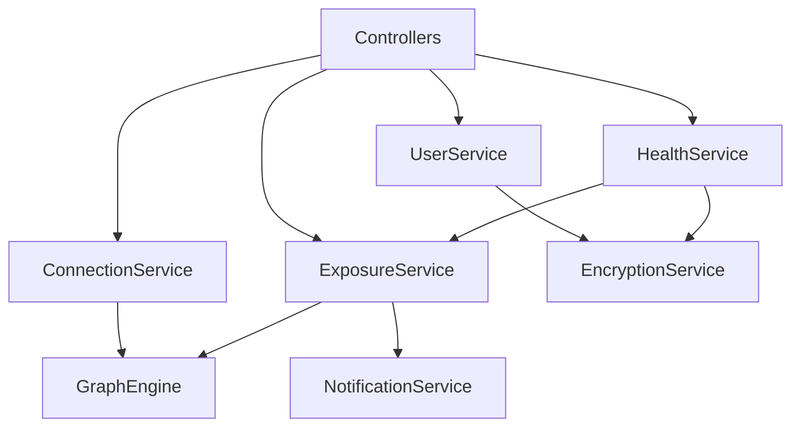

# Backend Services

Business logic layer of the Navilla backend.

:::note Work in Progress
Implementation details will be added as the backend is built.
:::

## Service Overview



## UserService

Handles user profile operations.

```java
@Service
public class UserService {

    public UserResponse getCurrentUser(Authentication auth);
    public void updateProfile(UpdateProfileRequest request);
    public void deleteAccount(Authentication auth);
}
```

## ConnectionService

Manages connection requests and confirmations.

```java
@Service
public class ConnectionService {

    public void requestConnection(String targetEmail);
    public void confirmConnection(UUID connectionId);
    public void denyConnection(UUID connectionId);
    public List<ConnectionResponse> getConnections();
    public List<ConnectionResponse> getPendingRequests();
}
```

## HealthService

Manages health status records.

```java
@Service
public class HealthService {

    public void reportStatus(HealthStatusRequest request);
    public void clearStatus(UUID statusId);
    public List<HealthStatusResponse> getMyStatuses();
}
```

## ExposureService

Calculates exposure snapshots.

```java
@Service
public class ExposureService {

    public ExposureSnapshot calculateExposure(String userHash);
    public ExposureResponse getExposureSnapshot();
    public void triggerBatchCalculation();
}
```

## NotificationService

Queues and sends notifications.

```java
@Service
public class NotificationService {

    public void queueExposureAlert(String userHash, ExposureData data);
    public void sendConnectionRequest(String userHash, UUID connectionId);
    public void processBatch();
}
```

## EncryptionService

Handles encryption/decryption operations.

```java
@Service
public class EncryptionService {

    public byte[] encrypt(String plaintext, String userHash);
    public String decrypt(byte[] ciphertext, String userHash);
    public String hashEmail(String email);
    public String hashUserId(String userId);
}
```
